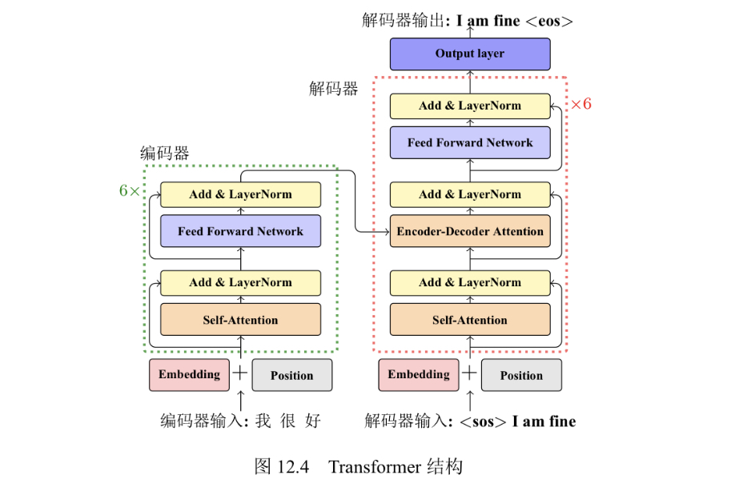

# 机器翻译作业
作者:尹张森,2101839
本项目使用pytorch框架实现[transformer](https://arxiv.org/abs/1706.03762)[1]

## 结果展示


```

```

## 数据集

使用预处理好的IWSLT’14 De-En数据集,源语言德语目标语言英语,使用双字节编码分词.

```

```

## Transformer

根据教材[2]的介绍,循环神经网络每个循环单元都有向前依赖性,也就是当前时间步的处理依赖前一时间步处理的结果。这个性质可以使序列的“历史”信息不断被传递,但是也造成模型运行效率的下降。特别是对于自然语言处理任务, 序列往往较长,无论是传统的 RNN 结构,还是更为复杂的 LSTM 结构,都需要很多次循环单元的处理才能够捕捉到单词之间的长距离依赖。由于需要多个循环单元的处理,距离较远的两个单词之间的信息传递变得很复杂.

Transformer 模型仅仅使用自注意力机制和标准的前馈神经网络,完全不依赖任何循环单元或者卷积操作。自注意力机制的优点在于可以直接对序列中任意两个单元之间的关系进行建模,这使得长距离依赖等问题可以更好地被求解。

下图展示了 Transformer 的结构。编码器由若干层组成(绿色虚线框就代表一层) 。每一层(Layer)的输入都是一个向量序列,输出是同样大小的向量序列,而Transformer 层的作用是对输入进行进一步的抽象,得到新的表示结果。不过这里的层并不是指单一的神经网络结构,它里面由若干不同的模块组成.



主要包括下列层:

- 嵌入层和位置编码
- 自注意力表示层(多头注意力机制)
- 前馈神经网络
- 残差连接和层标准化

### 嵌入层和位置编码层
嵌入层和位置编码层将编码器输入和解码器输入序列变成向量表示.
####嵌入层
使用pytorch的Embedding()函数实现嵌入
####位置编码
位置编码是一个固定的矩阵大小是(序列长度seq_len,嵌入向量长度emb_size)
Transformer中使用的是不同频率的三角函数
$$ PE(pos,2i)=sin(\frac{pos}{10000^{2i/emb\_size}})$$
$$ PE(pos,2i+1)=cos(\frac{pos}{10000^{2i/emb\_size}})$$

### 基于点乘的多头注意力机制
多头注意力机制就是在原来点乘注意力机制的基础上,把原来d_model长度的向量切分成heads份,运算后在连接起来.它的好处是允许模型在不同的表示子空间里学习.在很多实验里发现,不同的表示空间的头捕获的信息是不同的.
对于上一层输入的X(batch_size, seq_len, d_model),使用线性变换(没有激活函数)分别映射成QKV(batch_size, seq_len, d_model).需要注意在解码器中QKV的来源不用,Q来源于源语言,KV是目标语言的仿射变换.
之后对Q,K,V进行切分,切分的参数矩阵维度分别是(heads, d_model, d_k ),(heads, d_model, d_k )(heads, d_model, d_v );(d_k=d_v=d_model/heads),这样切分后的qkv向量进行运算后在连接起来可以获得一个(1,heads*d_k)的向量并且(heads*d_k=d_model),对输出向量右乘一个输出矩阵W(d_model,d_model)获得最终多头注意力机制的score.
最终输出的矩阵O大小应为(batch_size, seq_len, d_model),并且为了方便显示注意力机制也可以输出一个注意力权重矩阵.

## 模型的训练

因为没有显卡资源,只能把模型放到Colab上运行,只进行了少量参数调整

```
model_dim: 512
ffn_dim: 1024
head_num: 4
encoder_layers: 6
decoder_layers: 6
share_decoder_embedding: false
learn_rate = 0.0001
```

### 训练结果


##参考文献


